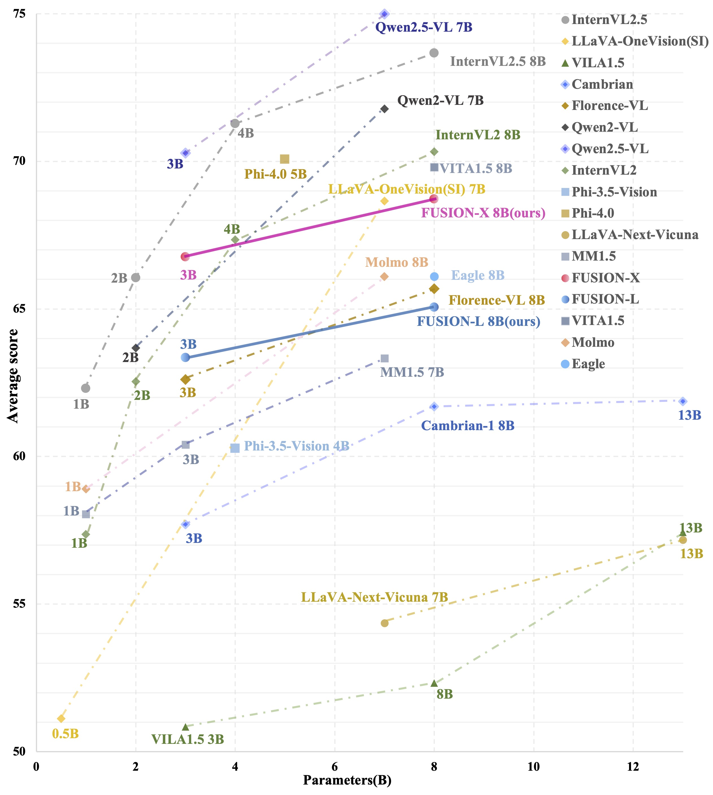
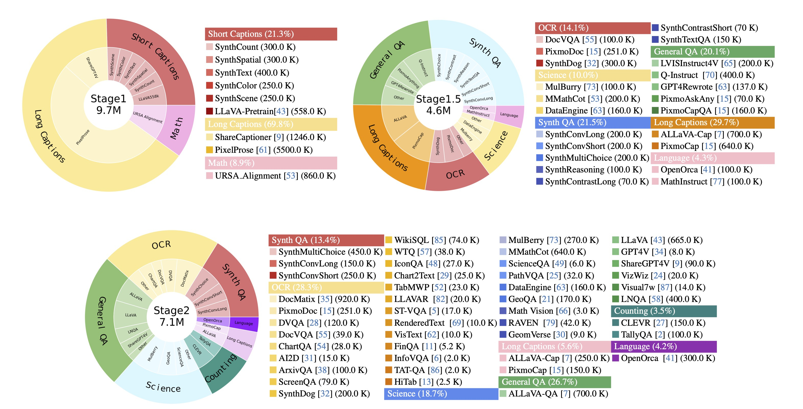
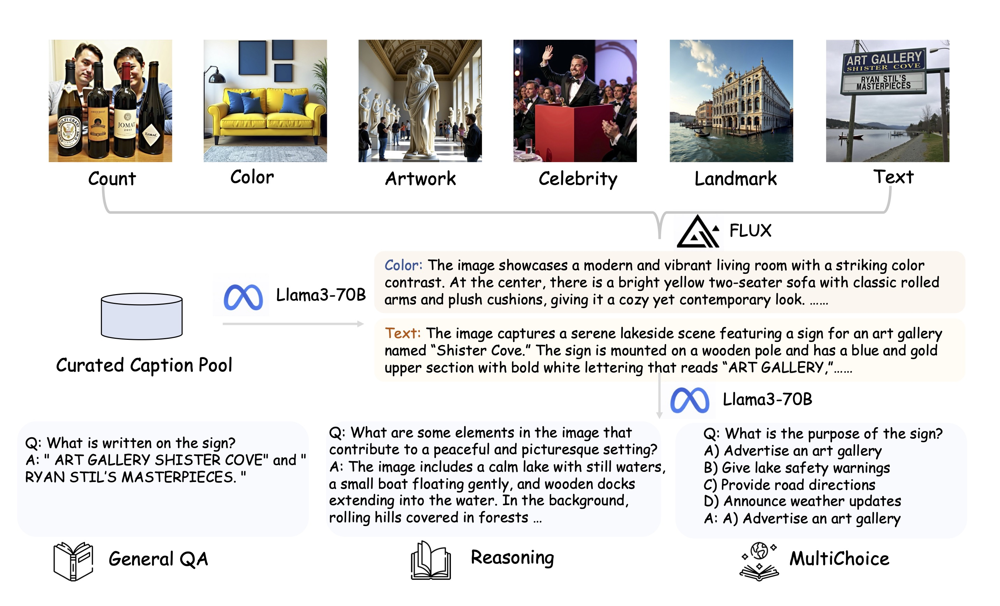

<div align="center">


#  *FUSION*:<br> Fully Integration of Vision-Language Representations for Deep Cross-Modal Understanding


<p>
    
</p>


<br>

> *With only 630 vision tokens, FUSION-X outperforms Cambrian-1 and Florence-VL, matching LLaVA-OneVision and nearly reaching the performance of top models like InternVL2 and Qwen2VL. Even with 300 vision tokens, FUSION-L retains 95% of its original performance, staying on par with Florence-VL.*
</div>


## Contents

- [Installation](#installation)
- [Usage](#usage)
- [FUSION Dataset](#fusion-dataset)
- [Train](#train)
- [Evaluation](#evaluation)

## Installation

1. navigate to FUSION-Code folder

```bash
cd FUSION-Code
```

2. Install Package

```Shell
conda create -n fusion python=3.10 -y
conda activate fusion
pip install --upgrade pip  # enable PEP 660 support
pip install -e .
```

3. Install additional packages for training cases

```
pip install -e ".[train]"
pip install flash-attn --no-build-isolation
```

### Upgrade to latest code base

```Shell
git pull
pip install -e .

# if you see some import errors when you upgrade,
# please try running the command below (without #)
# pip install flash-attn --no-build-isolation --no-cache-dir
```

## Usage

### Model Performance Comparison

| Model                     | # Vis Tok. | MMB_EN | MMB_CN | VizWiz | POPE | MM-Vet | MME_P | MME_C | Seed-Image | HallB | LLaVA_W | MMStar | MME-RW | RWQA | CV-Bench | MMVP | AI2D | MathVista | MMMU | SQA  | TextVQA | OCRBench | ChartQA | DocVQA |
| ------------------------- | :--------- | :----- | :----- | :----- | :--- | :----- | :------ | :------ | :--------- | :---- | :------ | :----- | :----- | :--- | :------- | :--- | :--- | :-------- | :--- | :--- | :------ | :------- | :------ | :----- |
| **<=4B Model Comparison** |            |        |        |        |      |        |         |         |            |       |         |        |        |      |          |      |      |           |      |      |         |          |         |        |
| **Qwen2.5VL 3B**          | -          | 79.1   | 78.1   | -      | 85.9 | 61.4   | 1592.4  | 607.5   | 74.0       | 46.6  | -       | 56.3   | 53.1   | 65.4 | -        | -    | 81.4 | 61.2      | 51.2 | 79.3 | -       | 82.8     | 84.0    | 93.93  |
| **InternVL2 4B**          | -          | 78.5   | 73.9   | -      | 84.6 | 50.5   | 1532.8  | 531.8   | 73.2       | 42.4  | -       | 53.9   | 52.1   | 60.5 | -        | -    | 79.0 | 58.5      | 48.3 | 96.0 | 74.7    | 78.4     | 81.5    | 89.2   |
| **DeepSeek-VL2-Tiny**     | -          | 74.6   | 72.1   | -      | -    | 52.5   | 1548.3  | 357.1   | 72.3       | 39.6  | -       | 45.9   | -      | 64.2 | -        | -    | 71.6 | 53.6      | 40.7 | -    | 80.7    | 80.5     | 81.0    | 86.9   |
| **MM1.5 3B**              | -          | -      | -      | -      | 88.1 | 41.0   | 1478.4  | 319.6   | 72.4       | -     | 73.0    | -      | -      | 56.9 | -        | -    | 65.7 | 44.4      | 37.1 | 85.8 | 76.5    | 65.7     | 74.2    | 87.5   |
| **Phi 3.5-Vision**        | -          | 75.5   | 64.2   | 58.2   | 82.2 | 46.5   | 1473.4  | 412.1   | 69.9       | 53.3  | 68.8    | 49.0   | -      | 53.5 | 69.3     | 67.7 | 77.4 | -         | 43.3 | 89.0 | 61.1    | 59.8     | 72.0    | 75.9   |
| **Florence-VL 3B**        | 576        | 71.6   | 60.8   | 59.1   | 88.3 | 51.0   | 1498.7  | 403.9   | 70.6       | 58.1  | 71.1    | 44.9   | -      | 60.4 | 70.2     | 64.7 | 73.8 | 52.2      | 41.8 | 84.6 | 69.1    | 63.0     | 70.7    | -      |
| **FUSION 3B (ours)**      | 780        | 79.5   | 71.7   | 64.6   | 88.9 | 57.2   | 1595.9  | 416.5   | 74.6       | 51.4  | 84.7    | 52.4   | 41.5   | 65.1 | 76.4     | 76.0 | 78.9 | 54.3      | 44.7 | 87.1 | 71.8    | 60.0     | 75.7    | 70.9   |
| **FUSION-X 3B (ours)**    | 620        | 80.3   | 74.8   | 66.1   | 88.7 | 60.3   | 1582.1  | 440.0   | 75.3       | 51.9  | 85.2    | 50.9   | 41.7   | 63.7 | 78.3     | 78.1 | 79.2 | 54.9      | 44.2 | 87.3 | 73.9    | 63.7     | 75.8    | 71.1   |
| **FUSION-L 3B (ours)**    | 308        | 77.6   | 70.8   | 65.3   | 88.3 | 56.7   | 1573.7  | 406.8   | 74.1       | 48.7  | 77.6    | 44.7   | 39.5   | 61.8 | 76.2     | 77.0 | 77.3 | 48.6      | 43.4 | 85.6 | 71.4    | 56.9     | 67.7    | 63.5   |
| **>=7B Model Comparison** |            |        |        |        |      |        |         |         |            |       |         |        |        |      |          |      |      |           |      |      |         |          |         |        |
| **Qwen2VL 7B**            | -          | 83.0   | 80.5   | -      | 88.4 | 62.0   | 1639.2  | 637.1   | 76.0       | 50.6  | -       | 60.7   | 57.4   | 70.1 | -        | -    | 83.0 | 58.2      | 54.1 | 85.5 | 84.3    | 86.6     | 83.0    | 94.5   |
| **InternVL2 8B**          | -          | 81.7   | 81.2   | -      | 86.9 | 54.2   | 1639.7  | 575.3   | 75.4       | 45.2  | -       | 61.5   | 53.5   | 64.4 | -        | -    | 83.6 | 58.3      | 52.6 | 96.3 | 77.4    | 79.4     | 83.3    | 91.6   |
| **LLaVA-OneVision 8B**    | -          | 81.7   | 78.0   | -      | 87.2 | 58.8   | 1626.0  | 483.0   | 74.8       | 47.5  | 86.9    | 60.9   | 57.5   | 65.5 | -        | -    | 81.6 | 56.1      | 47.7 | 96.6 | 78.5    | 69.7     | 78.8    | 87.5   |
| **MM1.5 7B**              | -          | -      | -      | -      | 88.6 | 42.2   | 1514.9  | 346.4   | 73.4       | -     | 74.2    | -      | -      | 62.5 | -        | -    | 72.2 | 47.6      | 41.8 | 89.6 | 76.5    | 63.5     | 88.1    | 78.2   |
| **Cambrian 8B**           | 576        | 75.9   | 67.9   | -      | 87.4 | 48.0   | 1547.1  | -       | 74.7       | 48.7  | 71.0    | 50.0   | -      | 64.2 | 72.2     | 51.3 | 73.0 | 49.0      | 42.7 | 80.4 | 71.7    | 62.4     | 73.3    | 77.8   |
| **Florence-VL 8B**        | 576        | 76.2   | 69.5   | 59.1   | 89.9 | 56.3   | 1560.0  | 381.1   | 74.9       | 57.3  | 74.2    | 50.0   | -      | 64.2 | 73.4     | 73.3 | 74.2 | 55.5      | 43.7 | 85.9 | 74.2    | 63.4     | 74.7    | -      |
| **Eagle 8B**              | 1024       | 75.9   | -      | -      | -    | -      | 1559.0  | -       | 76.3       | -     | -       | -      | -      | 66.5 | -        | 71.6 | 76.1 | 52.7      | 43.8 | 84.3 | 77.1    | 62.6     | 80.1    | 86.6   |
| **FUSION 8B (ours)**      | 780        | 80.5   | 74.9   | 59.5   | 89.3 | 60.0   | 1592.3  | 396.1   | 77.2       | 52.6  | 86.9    | 52.4   | 46.0   | 65.2 | 78.7     | 78.7 | 80.4 | 56.6      | 43.1 | 89.2 | 77.3    | 63.8     | 80.3    | 78.6   |
| **FUSION-X 8B (ours)**    | 620        | 82.0   | 76.2   | 62.9   | 88.8 | 60.0   | 1607.5  | 337.2   | 78.2       | 51.4  | 88.0    | 52.7   | 44.7   | 66.1 | 79.2     | 79.9 | 81.4 | 59.4      | 42.2 | 90.3 | 74.7    | 66.6     | 79.8    | 77.8   |
| **FUSION-L 8B (ours)**    | 308        | 80.0   | 73.6   | 59.9   | 88.5 | 57.3   | 1601.7  | 338.9   | 75.9       | 46.7  | 82.1    | 49.3   | 42.3   | 65.1 | 78.2     | 76.7 | 79.2 | 55.2      | 41.8 | 88.3 | 72.8    | 59.5     | 73.0    | 66.0   |

> *Despite using only 630 vision tokens, FUSION demonstrates performance comparable to current state-of-the-art models across most metrics. Notably, FUSION-X 3B achieved the highest score on MMBench among models under 4B in size, even surpassing Qwen2.5VL 3B!*

### Using FUSION

<details>
<summary>Example Code</summary>


```Python
from fusion.model.builder import load_pretrained_model
from fusion.mm_utils import get_model_name_from_path
from fusion.eval.run_fusion import eval_model

model_path = "FUSION_MODEL_PATH"
tokenizer, model, image_processor, context_len = load_pretrained_model(
    model_path=model_path,
    model_base=None,
    model_name=get_model_name_from_path(model_path)
)
```

Check out the details wth the `load_pretrained_model` function in `fusion/model/builder.py`.

You can also use the `eval_model` function in `fusion/eval/run_fusion.py` to get the output easily. 

``` python
model_path = "FUSION_MODEL_PATH"
prompt = "What statue is shown in the image? What name is the person?"
image_file = "images/example.png"

args = type('Args', (), {
    "model_path": model_path,
    "model_base": None,
    "model_name": get_model_name_from_path(model_path),
    "query": prompt,
    "conv_mode": None,
    "image_file": image_file,
    "sep": ",",
    "temperature": 0,
    "top_p": None,
    "num_beams": 1,
    "max_new_tokens": 512
})()

eval_model(args)
```

</details>


## FUSION Dataset

<p align="center">
    
</p>


The FUSION Dataset consists of large-scale, diverse multimodal data, designed for pretraining and fine-tuning in various tasks involving both vision and language understanding. The dataset includes two main versions:

   •   **FUSION-Pretrain-10M**

   •   **FUSION-Finetune-12M**

These datasets are built upon the Cambrian-1 7M dataset by significantly expanding both the quantity and variety of data. They are designed to improve model performance in tasks such as image captioning, visual reasoning, and logical deduction.

### Data Collection

FUSION-Pretrain-10M is primarily built upon high-quality image-caption datasets, including LLaVA-558K, ShareCaptioner-1.2M, and PixelProse-9M. 

FUSION-Finetune-12M leverages a diverse range of benchmark datasets spanning categories such as OCR, Science, and General QA. It also introduces additional datasets to improve model performance in domains such as math and visual reasoning including MMathCot and MulBerry.

The datasets also includes 4 million synthetic samples generated using our **Language-Driven QA Synthesis pipeline**, with the goal of improving instruction alignment and visual understanding. These 4 million synthetic samples are divided into:

   •   2M used for pretraining (PT)

   •   2M used for supervised fine-tuning (SFT)

### Synthesized Language-Driven QA Dataset

<p align="center">
    
</p>


To increase diversity and instruction alignment, **Language-Driven QA Synthesis pipeline** is used to generate synthesized data. The process includes the following steps:

1. **Caption Pool Collection**: A large pool of image captions is assembled from diverse datasets.

2.  **Description Expansion**: Captions are expanded into detailed descriptions using LLaMA3.1-70B.

3.  **Image Generation**: The expanded descriptions are used as prompts for FLUX.1 Dev to synthesize corresponding images.

4.  **QA Generation**: Descriptions and images are passed through LLaMA3.1-70B to generate high-quality Q&A pairs.

#### **Types of Synthetic Alignment Datasets**

The synthesized alignment data covers five primary categories:

   •   **SynthColor**: Describing and differentiating colors in the image.

   •   **SynthCount**: Counting and describing the number of objects in the image.

   •   **SynthSpatial**: Spatial relations between objects (e.g., left/right, above/below).

   •   **SynthScene**: General scene or landscape descriptions.

   •   **SynthText**: Identifying and describing visible text in the image.

#### Types of Synthetic Instruction Datasets

The synthesized instruction data covers six primary categories:

   •   **SynthMultiChoice QA**: Multi-turn dialogues with multiple-choice questions to teach the model to distinguish closely related options.

   •   **SynthConvShort QA**: Multi-turn dialogues with short answers focusing on fast key information extraction.

   •   **SynthConvLong QA**: Multi-turn dialogues with long-form answers to encourage detailed explanations.

   •   **SynthContrastShort QA & SynthContrastLong QA**: Dialogues comparing two similar images to train the model to observe subtle visual differences.

   •   **SynthReasoning QA**: Single-turn visual reasoning questions that require inference from visual inputs.
   
   •   **SynthText QA**: Multi-turn dialogues that identify and describe visible text in the image.

### FUSION-Pretrain-10M

FUSION-10M includes all of LLaVA-558K, ShareCaptioner-1.2M, and URSA-Alignment-860K, and we filtered 5.5M high-quality image-caption pairs from PixelProse. Additionally, we synthesized 2M specific types of image-caption pairs.

**Data Composition for Fusion-Pretrain-10M**

| **Category**   | **Percentage** |
| -------------- | -------------- |
| Short Captions | 21.3%          |
| Long Captions  | 69.8%          |
| Math Captions  | 8.9%           |

### FUSION-5M-Stage1.5

The Fusion-5M-Stage1.5 subset consists of 5 million samples used in the second phase of FUSION model training (Stage 1.5). This subset focuses on increasing the diversity of question types and conversational interactions.

**Data Composition for Fusion-Stage1.5**

| **Category**  | **Percentage** |
| ------------- | -------------- |
| Language      | 4.3%           |
| General       | 20.1%          |
| OCR           | 14.1%          |
| SynthQA       | 21.5%          |
| Science       | 10.0%          |
| Long Captions | 29.7%          |

### FUSION-7M-Stage2

The Fusion-7M-Stage2 subset includes 7 million samples used in the third phase of training (Stage 2). The focus here is on vision-centric instruction tuning. 

**Data Composition for Fusion-Stage2**

| **Category**  | **Percentage** |
| ------------- | -------------- |
| Language      | 2.9%           |
| General       | 27.4%          |
| OCR           | 28.9%          |
| Counting      | 3.6%           |
| SynthQA       | 12.3%          |
| Code          | 0.87%          |
| Science       | 19.2%          |
| Long Captions | 5.8%           |

### Data Usage Recommendation

For Pretrain, we recommend using the entire Fusion-Pretrain-10M dataset. 

For Finetune, if sft-training in two stages, we recommend first using Fusion-5M-Stage1.5 and then using Fusion-7M-Stage2 for the training process. For one-stage sft-training, to achieve better performance, we recommend merging the Fusion-5M-Stage1.5 and Fusion-7M-Stage2 datasets by using their respective JSON files for training.

## Train

Before training, you need to organize the training data according to [data.md](docs/data.md)

Below is the latest training configuration for FUSION.

We introduce a three-stage training framework, distinct from traditional two-stage paradigms, ensuring comprehensive alignment and integration between visual and linguistic modalities. In each stage, we unfreeze all components to ensure comprehensive optimization and seamless integration.

1. **Foundational Semantic Alignment**: We use FUSION-Pretrain-10M data to pretrain the vision encoder to establish precise semantic alignment between visual and textual representations.
2. **Contextual Multimodal Fusion**: We use FUSION-5M-Stage1.5 to enhance the model’s adaptability in aligning vision and language representations across a broad spectrum of scenarios.
3. **Visual Instruction Tuning**: We use FUSION-7M-Stage2 to expose the model to various visual tasks, enabling it to answer downstream vision-related questions effectively.

### Hyperparameters

Both hyperparameters used in pretraining and finetuning are provided below.

#### 1. Foundational Semantic Alignment

| Model Name   |   Base LLM   |      Base Vision Encoder      | Global Batch Size | Learning rate | Vision Tower Learning Rate | Epochs | Max length |
| ------------ | :----------: | :---------------------------: | :---------------: | :------------------------: | :------------------------: | :----: | ---------- |
| FUSION 3B    |  Phi3.5 3B   |   siglip-so400m-patch14-384   |        256        |            2e-5            |            2e-5            |   1    | 2048       |
| FUSION- X 3B |  Phi3.5 3B   | siglip2-giant-opt-patch16-384 |        256        |            2e-5            |            2e-5            |   1    | 2048       |
| FUSION 8B    | LLaMA-3.1 8B |   siglip-so400m-patch14-384   |        256        |            2e-5            |            2e-5            |   1    | 2048       |
| FUSION-X 8B  | LLaMA-3.1 8B | siglip2-giant-opt-patch16-384 |        256        |            2e-5            |            2e-5            |   1    | 2048       |

#### 2. Contextual Multimodal Fusion

| Model Name   |   Base LLM   |      Base Vision Encoder      | Global Batch Size | Learning rate | Vision Tower Learning Rate | Epochs | Max length |
| ------------ | :----------: | :---------------------------: | :---------------: | :------------------------: | :------------------------: | :----: | :--------: |
| FUSION 3B    |  Phi3.5 3B   |   siglip-so400m-patch14-384   |        128        |            2e-5            |            2e-6            |   1    |    4096    |
| FUSION- X 3B |  Phi3.5 3B   | siglip2-giant-opt-patch16-384 |        128        |            2e-5            |            2e-6            |   1    |    4096    |
| FUSION 8B    | LLaMA-3.1 8B |   siglip-so400m-patch14-384   |        128        |            2e-5            |            2e-6            |   1    |    4096    |
| FUSION-X 8B  | LLaMA-3.1 8B | siglip2-giant-opt-patch16-384 |        128        |            2e-5            |            2e-6            |   1    |    4096    |

#### 3. Visual Instruction Tuning

| Model Name   |   Base LLM   |      Base Vision Encoder      | Global Batch Size | Learning rate | Vision Tower Learning Rate | Epochs | Max length |
| ------------ | :----------: | :---------------------------: | :---------------: | :------------------------: | :------------------------: | :----: | :--------: |
| FUSION 3B    |  Phi3.5 3B   |   siglip-so400m-patch14-384   |        128        |            1e-5            |            1e-6            |   1    |    4096    |
| FUSION- X 3B |  Phi3.5 3B   | siglip2-giant-opt-patch16-384 |        128        |            1e-5            |            1e-6            |   1    |    4096    |
| FUSION 8B    | LLaMA-3.1 8B |   siglip-so400m-patch14-384   |        128        |            1e-5            |            1e-6            |   1    |    4096    |
| FUSION-X 8B  | LLaMA-3.1 8B | siglip2-giant-opt-patch16-384 |        128        |            1e-5            |            1e-6            |   1    |    3072    |

### Foundational Semantic Alignment

We provide sample training scripts in:

- [fusion_3b_stage1](scripts/train/fusion_3b_stage1.sh)
- [fusion-x_3b_stage1](scripts/train/fusion-x_3b_stage1.sh)
- [fusion_8b_stage1](scripts/train/fusion_8b_stage1.sh)
- [fusion-x_8b_stage1](scripts/train/fusion-x_8b_stage1.sh)


### Contextual Multimodal Fusion

We provide sample training scripts in:

- [fusion_3b_stage1.5](scripts/train/fusion_3b_stage1.5.sh)
- [fusion-x_3b_stage1.5](scripts/train/fusion-x_3b_stage1.5.sh)
- [fusion_8b_stage1.5](scripts/train/fusion_8b_stage1.5.sh)
- [fusion-x_8b_stage1.5](scripts/train/fusion-x_8b_stage1.5.sh)

### Visual Instruction Tuning

We provide sample training scripts in:

- [fusion_3b_stage2](scripts/train/fusion_3b_stage2.sh)
- [fusion-x_3b_stage2](scripts/train/fusion-x_3b_stage2.sh)
- [fusion_8b_stage2](scripts/train/fusion_8b_stage2.sh)
- [fusion-x_8b_stage2](scripts/train/fusion-x_8b_stage2.sh)

### Options to note:

- `--image_aspect_ratio`: To use our fusion model, set this value to `static_hd`. 
- `--window_size`: The window size in our interaction layers’ localized window size, which is set to a default value of 3.
- `--query_len`: the values for context-aware latent token lengths, where each value must be a perfect square. It is usually set to a single length or a series of candidate values (e.g. “4, 16, 36, 64, 144”).
- `--num_of_vision_sampler_layers`: The total number of interaction layers inserted inside the LLM.
- `--start_of_vision_sampler_layers`: The LLM layer index after which the insertion of interaction layers begins.
- `--stride_of_vision_sampler_layers`: The stride of the interaction layers module insertion inside the LLM.

## Evaluation

We have released our evaluation code in the [`eval/`](scripts/eval) subfolder. Please see [evaluation.md](docs/evaluation.md) for more details.

